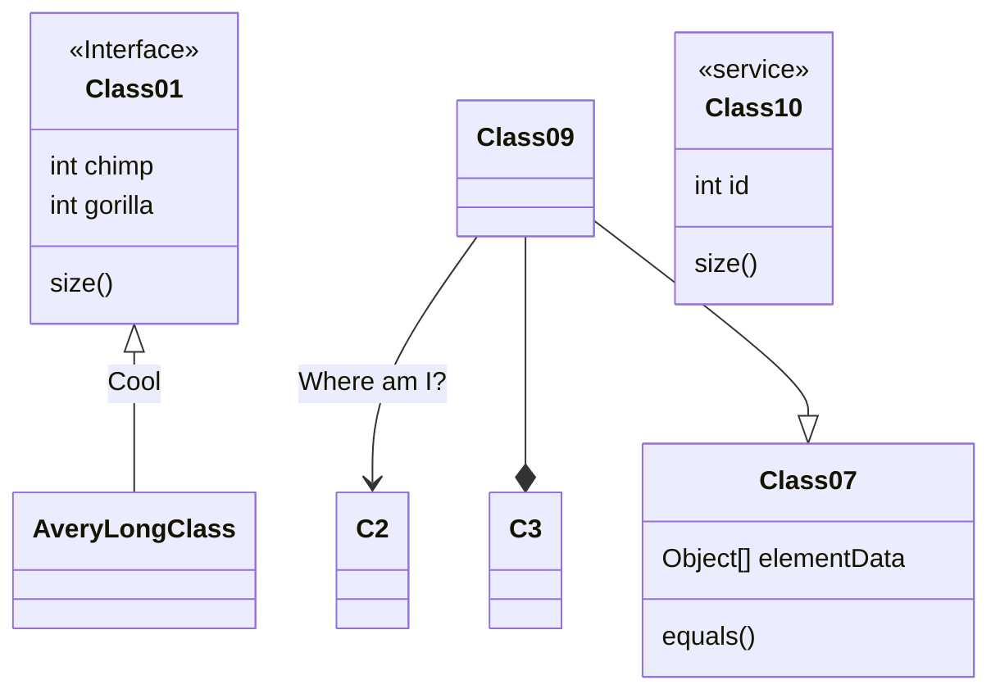
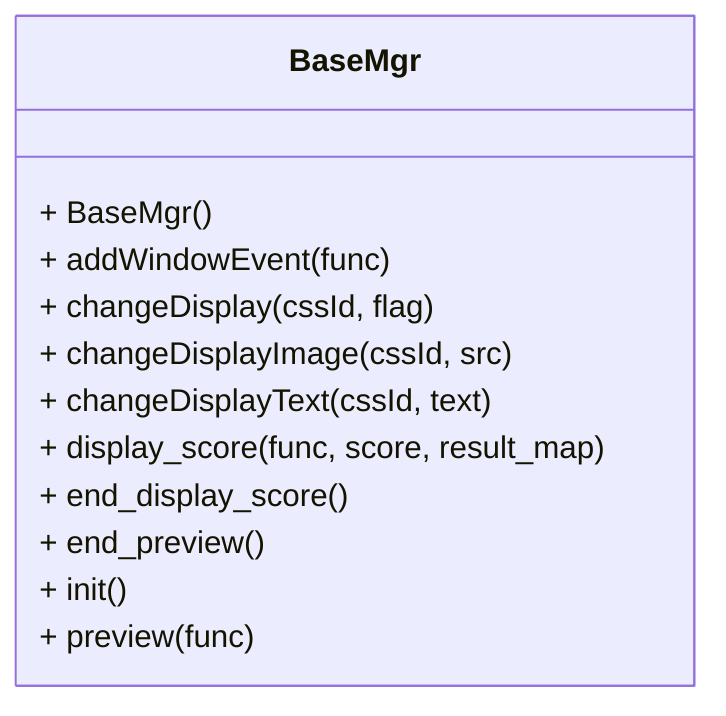

```mermaid
classDiagram
Class01 <|-- AveryLongClass : Cool
<<Interface>> Class01
Class09 --> C2 : Where am I?
Class09 --* C3
Class09 --|> Class07
Class07 : equals()
Class07 : Object[] elementData
Class01 : size()
Class01 : int chimp
Class01 : int gorilla
class Class10 {
  <<service>>
  int id
  size()
}


```

```mermaid
classDiagram
class BaseMgr {
+ BaseMgr()
+ addWindowEvent(func)
+ changeDisplay(cssId, flag)
+ changeDisplayImage(cssId, src)
+ changeDisplayText(cssId, text)
+ display_score(func, score, result_map)
+ end_display_score()
+ end_preview()
+ init()
+ preview(func)
}
```

