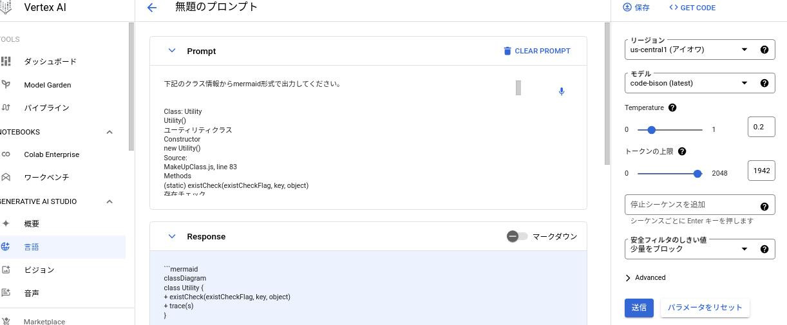

# ブラウザで動作するメイクの練習アプリ。

# ##背景
妻がパーソナルカラー診断を得意としている。
パーソナルカラーに関するWEBサイトを運用していて、
パーソナルカラーに合わせたメイクカラーを練習するアプリを作ることとなった。
妻が企画、デザイン、イラストを担当し、私がプログラム作成を担当して、本アプリを作成した。

[スパルタ！パーソナルカラー塾](https://color.toshidayurika.com/wp-content/makeup/makeup.php)

せっかくなので、このアプリをポートフォリオとして公開することにした。

※ 直感的に操作できるのでまずは上記リンク先から触ってみてください。

# ##機能概要と使用方法
## 機能概要
ブラウザで動作するメイクの練習アプリ。
メイクでは自分にあった色を選択するのが難しい。
そこでこのアプリではパーソナルカラーから調和の取れたメイクカラーを選択できるように練習する機能を提供する。

## 使用方法
下記リンク先を参照

[スパルタ！パーソナルカラー塾](https://color.toshidayurika.com/spartncolorschool/)

## アーキテクチャ
Javascript。
バックエンドはPHPだがほとんど何もしていない。
フロントエンドのJavascriptで機能を実現している。

# ##設計情報(AIを活用した設計書生成実験）

本アプリは数年前に作成したが、全くドキュメントを残していなかった。
マニュアルで一から作成する気にはなれなかったので、AI活用に慣れることをモチベーションに
GCPのVertex AI(code-vision)を使用して設計書を作成してみることにした。

このAIは本来は、ドキュメントからコードを生成するものだが、
逆にコードからドキュメントを生成するために利用した。

やってみた感想としては、後から人が修正する前提で初期バージョン生成には良いと感じた。
もし、本物のプロジェクトで活用するとしたら、事前に十分に検証してどう活用するか、ドキュメントの品質レベルはどの
程度にするかよく検討するフェーズが必須だと思う。

まだ、もう少し時間がかかりそうだが、設計書よりもコードから作成した方が早い人が多い
プロジェクトではAIが設計書を作るようになると感じた。

## クラス図
***[クラス図](./classDiagram.md)***

上記リンク先のクラス図はVertex AIを活用し下記の手順で作成した。
- 下記"JSDOC形式のドキュメンテーション"をブラウザで開く。
- ブラウザで開いたクラス情報をコピー＆ペーストでAIのプロンプトに貼り付け。
- Mermaid形式で出力するようにAIに依頼。
- 生成されたMermaid形式のテキストを拡張子mdのファイルに保存+GithubにPush。

このクラス図は若干、マニュアルで修正したがほぼAIが出力した状態そのままである。

Vertex AIへの支持は下記のような作業イメージ

## JSDOC
***[JSDOC形式のドキュメンテーション](https://data2coordi.github.io/pub_makeup/out/index.html)***

上記リンク先のJSDOCのドキュメントもVertex AIを活用して作成した。
JavascriptのコードにJSDOCコメント付与をAIに指示してJSDOCコメント付きJavascriptコードを作成。
その後、jsdocコマンドでHTML形式のドキュメントを生成している。
完全にAIが生成した状態そのままである。

