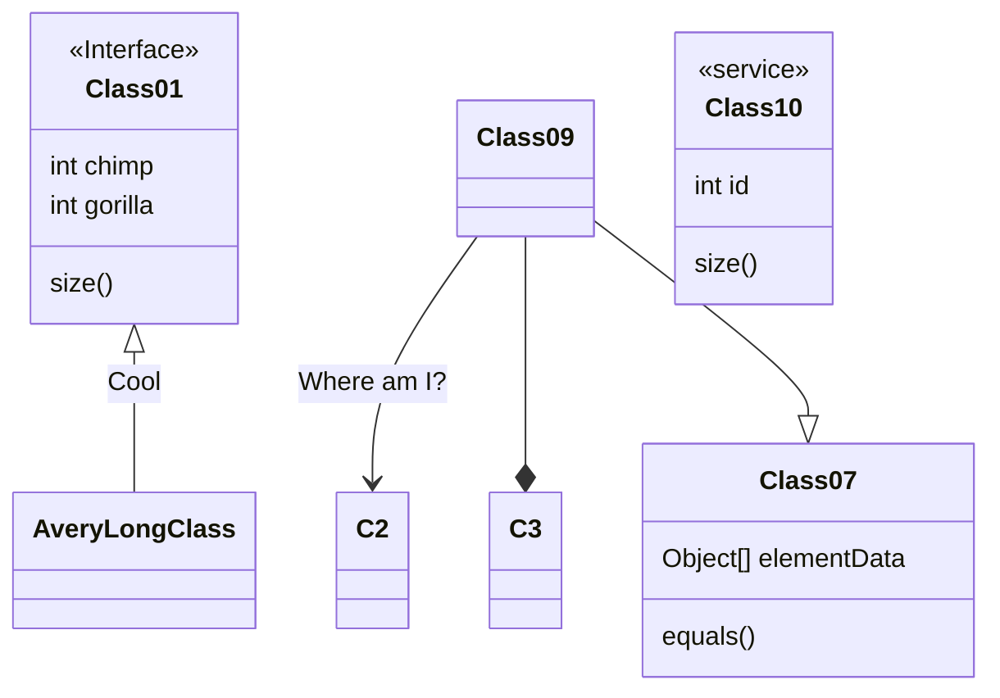
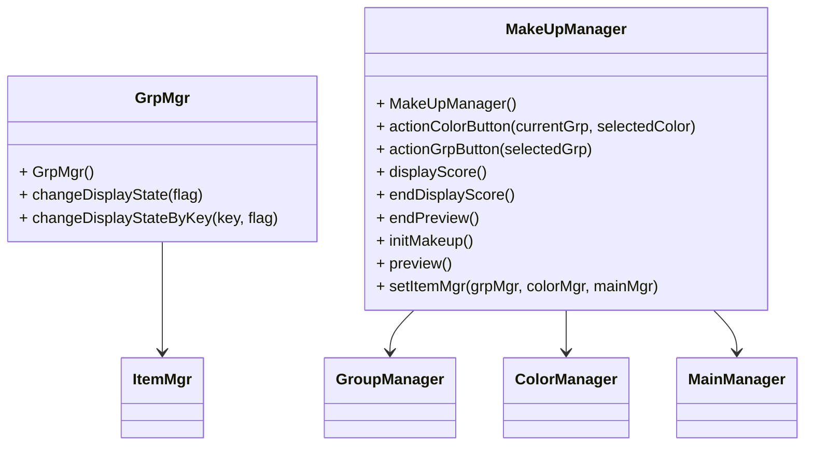
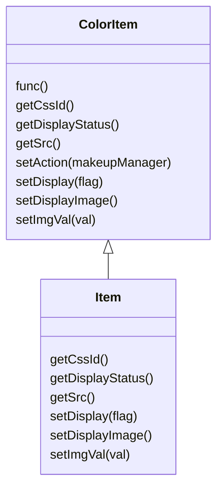

```mermaid
classDiagram
Class01 <|-- AveryLongClass : Cool
<<Interface>> Class01
Class09 --> C2 : Where am I?
Class09 --* C3
Class09 --|> Class07
Class07 : equals()
Class07 : Object[] elementData
Class01 : size()
Class01 : int chimp
Class01 : int gorilla
class Class10 {
  <<service>>
  int id
  size()
}


```

```mermaid
classDiagram
class GrpMgr {
+ GrpMgr()
+ changeDisplayState(flag)
+ changeDisplayStateByKey(key, flag)
}

class MakeUpManager {
+ MakeUpManager()
+ actionColorButton(currentGrp, selectedColor)
+ actionGrpButton(selectedGrp)
+ displayScore()
+ endDisplayScore()
+ endPreview()
+ initMakeup()
+ preview()
+ setItemMgr(grpMgr, colorMgr, mainMgr)
}

GrpMgr --> ItemMgr
MakeUpManager --> GroupManager
MakeUpManager --> ColorManager
MakeUpManager --> MainManager
```

```mermaid
classDiagram
class ColorItem {
func()
getCssId()
getDisplayStatus()
getSrc()
setAction(makeupManager)
setDisplay(flag)
setDisplayImage()
setImgVal(val)
}

class Item {
getCssId()
getDisplayStatus()
getSrc()
setDisplay(flag)
setDisplayImage()
setImgVal(val)
}

ColorItem <|-- Item
```

