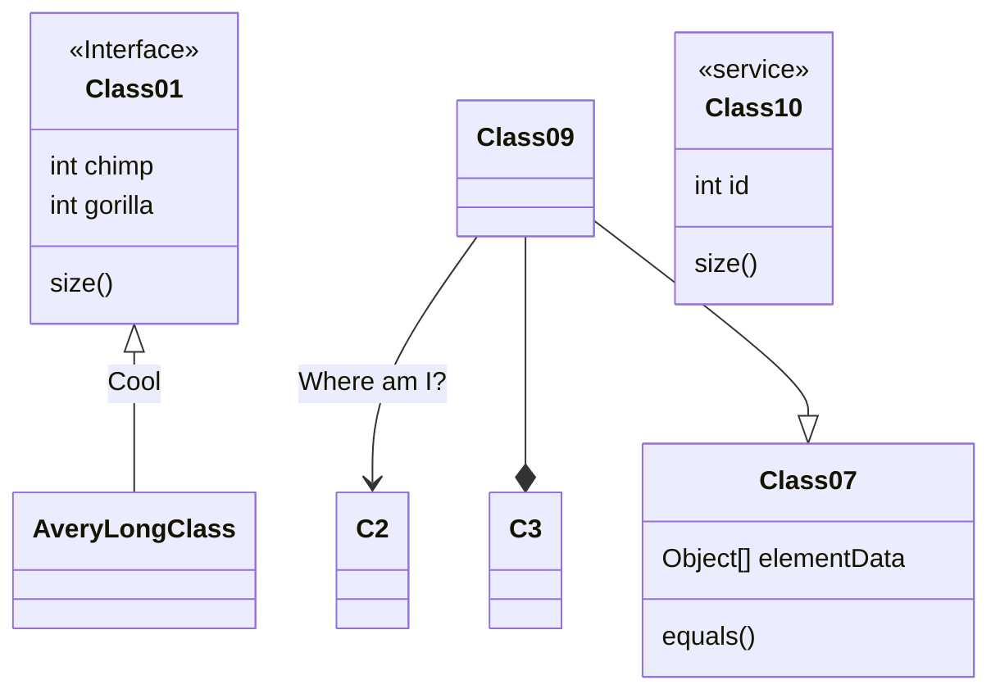
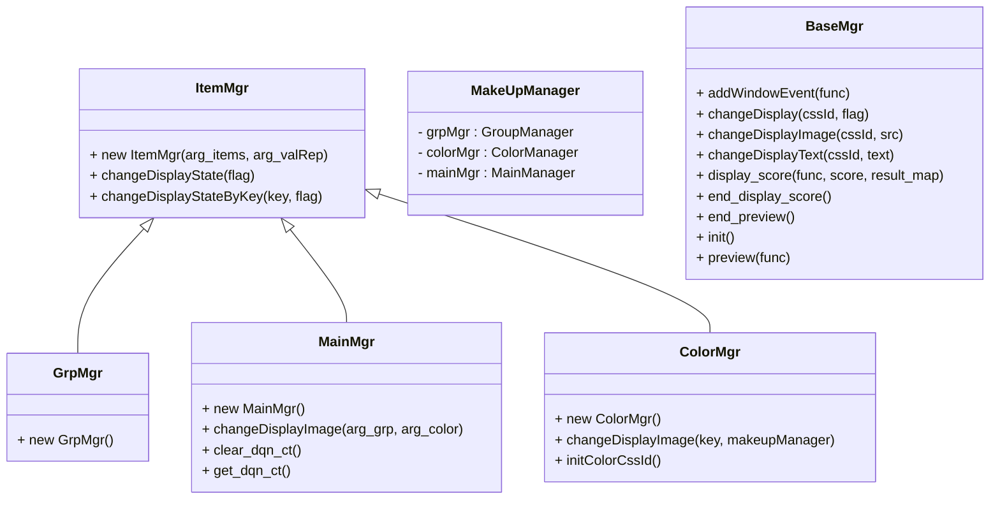
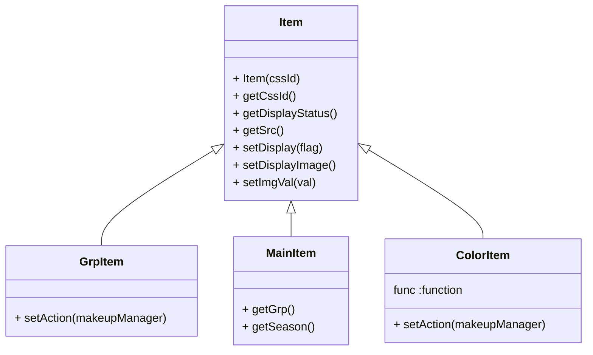
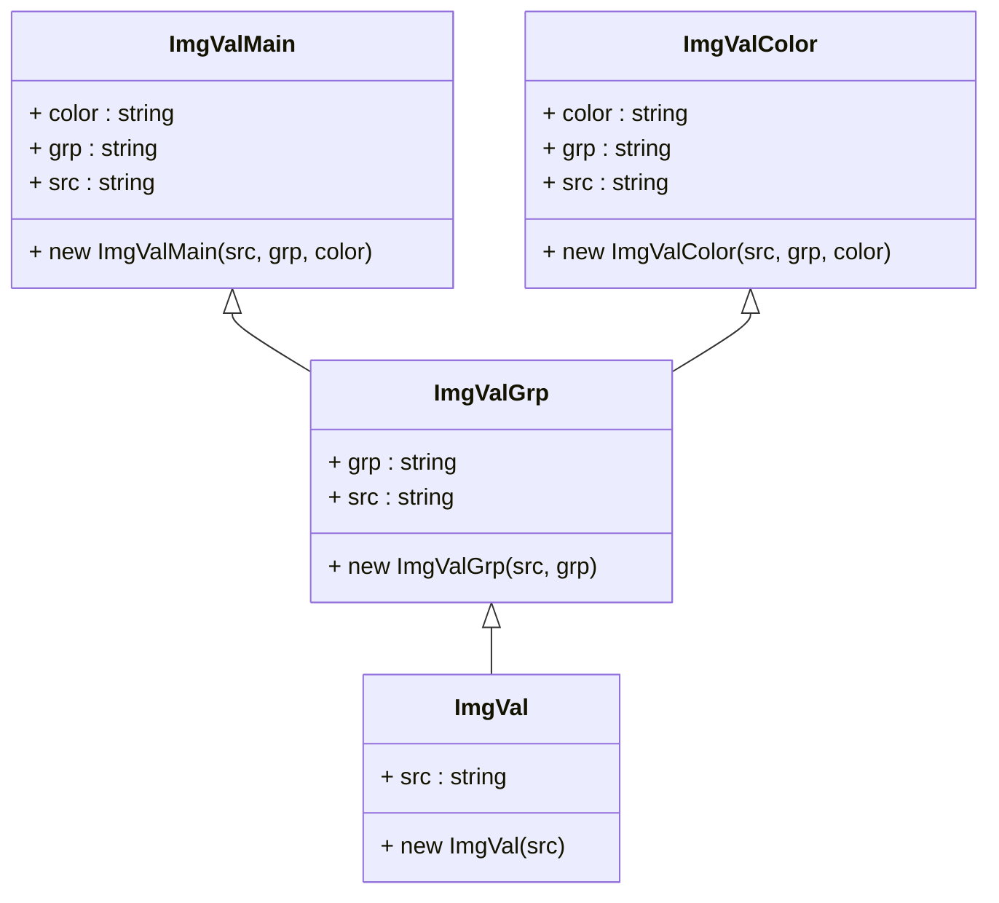
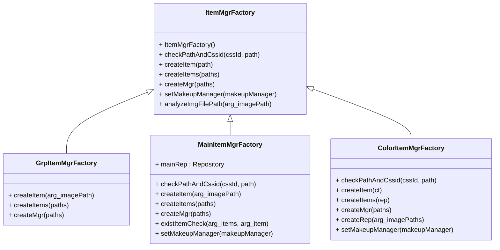
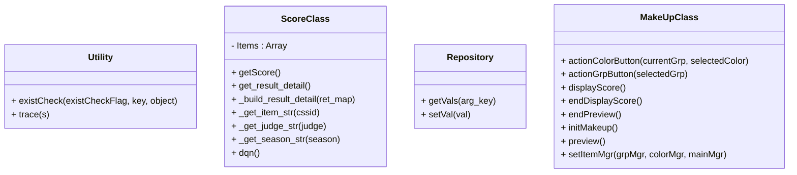

```mermaid
classDiagram
Class01 <|-- AveryLongClass : Cool
<<Interface>> Class01
Class09 --> C2 : Where am I?
Class09 --* C3
Class09 --|> Class07
Class07 : equals()
Class07 : Object[] elementData
Class01 : size()
Class01 : int chimp
Class01 : int gorilla
class Class10 {
  <<service>>
  int id
  size()
}

```

# Manager

```mermaid
classDiagram


ItemMgr <|-- GrpMgr
ItemMgr <|-- MainMgr
ItemMgr <|-- ColorMgr


class ItemMgr {
+ new ItemMgr(arg_items, arg_valRep)
+ changeDisplayState(flag)
+ changeDisplayStateByKey(key, flag)
}

class GrpMgr  {
+ new GrpMgr()
}

class MainMgr  {
+ new MainMgr()
+ changeDisplayImage(arg_grp, arg_color)
+ clear_dqn_ct()
+ get_dqn_ct()
}

class ColorMgr  {
+ new ColorMgr()
+ changeDisplayImage(key, makeupManager)
+ initColorCssId()
}


class MakeUpManager {
- grpMgr : GroupManager
- colorMgr : ColorManager
- mainMgr : MainManager
}

class BaseMgr {
+ addWindowEvent(func)
+ changeDisplay(cssId, flag)
+ changeDisplayImage(cssId, src)
+ changeDisplayText(cssId, text)
+ display_score(func, score, result_map)
+ end_display_score()
+ end_preview()
+ init()
+ preview(func)
}

```

# Item

```mermaid
classDiagram
class Item {
+ Item(cssId)
+ getCssId()
+ getDisplayStatus()
+ getSrc()
+ setDisplay(flag)
+ setDisplayImage()
+ setImgVal(val)
}


class GrpItem  {
+ setAction(makeupManager)
}

Item <|-- GrpItem

class MainItem  {
+ getGrp()
+ getSeason()
}

Item <|-- MainItem

class ColorItem {
func :function
+ setAction(makeupManager)
}


Item <|-- ColorItem
```

# Image

```mermaid
classDiagram
class ImgVal {
+ src : string
+ new ImgVal(src)
}

class ImgValMain {
+ color : string
+ grp : string
+ src : string
+ new ImgValMain(src, grp, color)
}

ImgValMain <|-- ImgValGrp

class ImgValColor {
+ color : string
+ grp : string
+ src : string
+ new ImgValColor(src, grp, color)
}

ImgValColor <|-- ImgValGrp

class ImgValGrp {
+ grp : string
+ src : string
+ new ImgValGrp(src, grp)
}

ImgValGrp <|-- ImgVal
```

# Factory

```mermaid
classDiagram
ItemMgrFactory <|-- GrpItemMgrFactory
ItemMgrFactory <|-- MainItemMgrFactory
ItemMgrFactory <|-- ColorItemMgrFactory

class ItemMgrFactory {
+ ItemMgrFactory()
+ checkPathAndCssid(cssId, path)
+ createItem(path)
+ createItems(paths)
+ createMgr(paths)
+ setMakeupManager(makeupManager)
+ analyzeImgFilePath(arg_imagePath)
}

class GrpItemMgrFactory  {
+ createItem(arg_imagePath)
+ createItems(paths)
+ createMgr(paths)
}

class MainItemMgrFactory  {
+ mainRep : Repository
+ checkPathAndCssid(cssId, path)
+ createItem(arg_imagePath)
+ createItems(paths)
+ createMgr(paths)
+ existItemCheck(arg_items, arg_item)
+ setMakeupManager(makeupManager)
}

class ColorItemMgrFactory  {
+ checkPathAndCssid(cssId, path)
+ createItem(ct)
+ createItems(rep)
+ createMgr(paths)
+ createRep(arg_imagePaths)
+ setMakeupManager(makeupManager)
}

```

# Else 

```mermaid
classDiagram
class Utility {
+ existCheck(existCheckFlag, key, object)
+ trace(s)
}

class ScoreClass {
- Items : Array
+ getScore()
+ get_result_detail()
+ _build_result_detail(ret_map)
+ _get_item_str(cssid)
+ _get_judge_str(judge)
+ _get_season_str(season)
+ dqn()
}

class Repository {
+ getVals(arg_key)
+ setVal(val)
}

class MakeUpClass {
+ actionColorButton(currentGrp, selectedColor)
+ actionGrpButton(selectedGrp)
+ displayScore()
+ endDisplayScore()
+ endPreview()
+ initMakeup()
+ preview()
+ setItemMgr(grpMgr, colorMgr, mainMgr)
}

```

