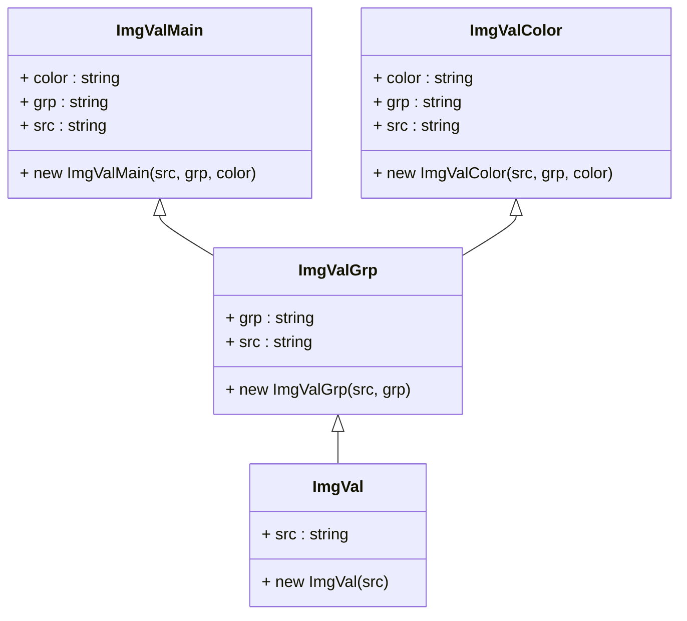
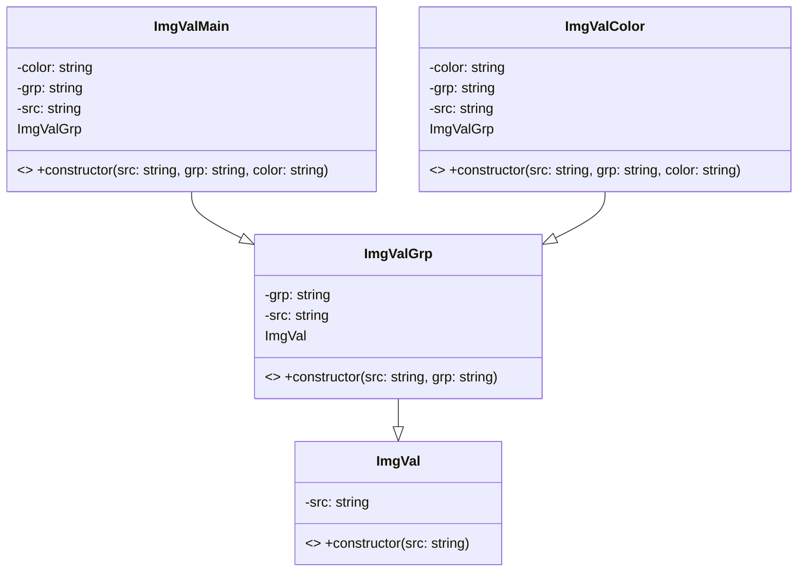

# Image

```mermaid
classDiagram
class ImgVal {
+ src : string
+ new ImgVal(src)
}

class ImgValMain {
+ color : string
+ grp : string
+ src : string
+ new ImgValMain(src, grp, color)
}

ImgValMain <|-- ImgValGrp

class ImgValColor {
+ color : string
+ grp : string
+ src : string
+ new ImgValColor(src, grp, color)
}

ImgValColor <|-- ImgValGrp

class ImgValGrp {
+ grp : string
+ src : string
+ new ImgValGrp(src, grp)
}

ImgValGrp <|-- ImgVal
```

```mermaid
classDiagram
  class ImgVal {
    <<ValueObject>> +constructor(src: string)
    -src: string
  }

  class ImgValMain {
    <<ValueObject>> +constructor(src: string, grp: string, color: string)
    -color: string
    -grp: string
    -src: string
    ImgValGrp
  }

  class ImgValColor {
    <<ValueObject>> +constructor(src: string, grp: string, color: string)
    -color: string
    -grp: string
    -src: string
    ImgValGrp
  }

  class ImgValGrp {
    <<ValueObject>> +constructor(src: string, grp: string)
    -grp: string
    -src: string
    ImgVal
  }

  ImgValMain --|> ImgValGrp
  ImgValColor --|> ImgValGrp
  ImgValGrp --|> ImgVal

```

