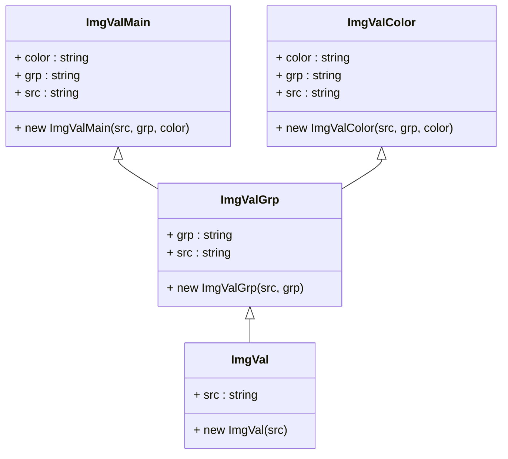
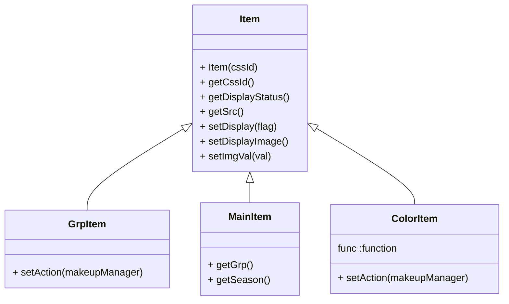
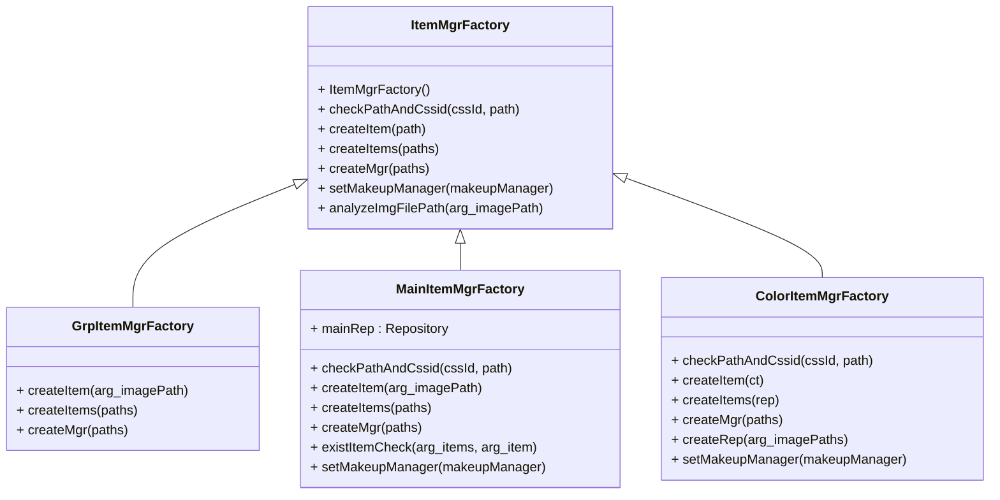
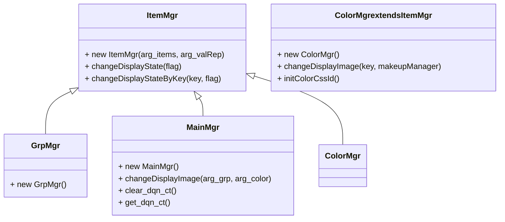

# Image

```mermaid
classDiagram
class ImgVal {
+ src : string
+ new ImgVal(src)
}

class ImgValMain {
+ color : string
+ grp : string
+ src : string
+ new ImgValMain(src, grp, color)
}

ImgValMain <|-- ImgValGrp

class ImgValColor {
+ color : string
+ grp : string
+ src : string
+ new ImgValColor(src, grp, color)
}

ImgValColor <|-- ImgValGrp

class ImgValGrp {
+ grp : string
+ src : string
+ new ImgValGrp(src, grp)
}

ImgValGrp <|-- ImgVal
```

# Item

```mermaid
classDiagram
class Item {
+ Item(cssId)
+ getCssId()
+ getDisplayStatus()
+ getSrc()
+ setDisplay(flag)
+ setDisplayImage()
+ setImgVal(val)
}


class GrpItem  {
+ setAction(makeupManager)
}

Item <|-- GrpItem

class MainItem  {
+ getGrp()
+ getSeason()
}

Item <|-- MainItem

class ColorItem {
func :function
+ setAction(makeupManager)
}


Item <|-- ColorItem
```

# Factory

```mermaid
classDiagram
ItemMgrFactory <|-- GrpItemMgrFactory
ItemMgrFactory <|-- MainItemMgrFactory
ItemMgrFactory <|-- ColorItemMgrFactory

class ItemMgrFactory {
+ ItemMgrFactory()
+ checkPathAndCssid(cssId, path)
+ createItem(path)
+ createItems(paths)
+ createMgr(paths)
+ setMakeupManager(makeupManager)
+ analyzeImgFilePath(arg_imagePath)
}

class GrpItemMgrFactory  {
+ createItem(arg_imagePath)
+ createItems(paths)
+ createMgr(paths)
}

class MainItemMgrFactory  {
+ mainRep : Repository
+ checkPathAndCssid(cssId, path)
+ createItem(arg_imagePath)
+ createItems(paths)
+ createMgr(paths)
+ existItemCheck(arg_items, arg_item)
+ setMakeupManager(makeupManager)
}

class ColorItemMgrFactory  {
+ checkPathAndCssid(cssId, path)
+ createItem(ct)
+ createItems(rep)
+ createMgr(paths)
+ createRep(arg_imagePaths)
+ setMakeupManager(makeupManager)
}

```

# Manager

```mermaid
classDiagram

ItemMgr <|-- GrpMgr
ItemMgr <|-- MainMgr
ItemMgr <|-- ColorMgr


class ItemMgr {
+ new ItemMgr(arg_items, arg_valRep)
+ changeDisplayState(flag)
+ changeDisplayStateByKey(key, flag)
}

class GrpMgr  {
+ new GrpMgr()
}

class MainMgr  {
+ new MainMgr()
+ changeDisplayImage(arg_grp, arg_color)
+ clear_dqn_ct()
+ get_dqn_ct()
}

class ColorMgr extends ItemMgr {
+ new ColorMgr()
+ changeDisplayImage(key, makeupManager)
+ initColorCssId()
}
```
