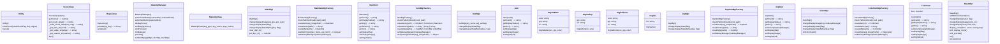

```mermaid
classDiagram
class Utility {
Utility()
existCheck(existCheckFlag, key, object)
trace(s)
}

class ScoreClass {
ScoreClass(items)
getScore() -> number
get_result_detail() -> string
_build_result_detail(ret_map) -> string
_get_item_str(cssid) -> string
_get_judge_str(judge) -> string
_get_season_str(season) -> string
dqn()
}

class Repository {
Repository()
getVals(arg_key) -> Array.<ImgVal>
setVal(val)
}

class MakeUpManager {
MakeUpManager()
actionColorButton(currentGrp, selectedColor)
actionGrpButton(selectedGrp)
displayScore()
endDisplayScore()
endPreview()
initMakeup()
preview()
setItemMgr(grpMgr, colorMgr, mainMgr)
}

class MakeUpClass {
MakeUpClass(arg_grps, arg_colors, args_mains)
}

class MainMgr {
MainMgr()
changeDisplayImage(arg_grp, arg_color)
changeDisplayState(flag)
changeDisplayStateByKey(key, flag)
clear_dqn_ct()
get_dqn_ct() -> number
}

class MainItemMgrFactory {
MainItemMgrFactory()
checkPathAndCssid(cssId, path)
createItem(arg_imagePath) -> MainItem
createItems(paths) -> Array.<MainItem>
createMgr(paths) -> MainMgr
existItemCheck(arg_items, arg_item) -> boolean
setMakeupManager(makeupManager)
}

class MainItem {
MainItem()
getCssId() -> string
getDisplayStatus() -> string
getGrp() -> string
getSeason() -> string
getSrc() -> string
setDisplay(flag)
setDisplayImage()
setImgVal(val)
}

class ItemMgrFactory {
ItemMgrFactory()
checkPathAndCssid(cssId, path)
createItem(path) -> GrpItem | ColorItem | MainItem
createItems(paths) -> Array.<GrpItem> | Array.<ColorItem> | Array.<MainItem>
createMgr(paths) -> GrpMgr | ColorMgr | MainMgr
setMakeupManager(makeupManager)
analyzeImgFilePath(arg_imagePath) -> Object
}

class ItemMgr {
ItemMgr(arg_items, arg_valRep)
changeDisplayState(flag)
changeDisplayStateByKey(key, flag)
}

class Item {
Item(cssId)
getCssId() -> string
getDisplayStatus() -> string
getSrc() -> string
setDisplay(flag)
setDisplayImage()
setImgVal(val)
}

class ImgValMain {
ImgValMain(src, grp, color)
color :string
grp :string
src :string
}

class ImgValGrp {
ImgValGrp(src, grp)
grp :string
src :string
}

class ImgValColor {
ImgValColor(src, grp, color)
color :string
grp :string
src :string
}

class ImgVal {
ImgVal(src)
src :string
}

class GrpMgr {
GrpMgr()
changeDisplayState(flag)
changeDisplayStateByKey(key, flag)
}

class GrpItemMgrFactory {
GrpItemMgrFactory()
checkPathAndCssid(cssId, path)
createItem(arg_imagePath) -> GrpItem
createItems(paths) -> Array.<GrpItem>
createMgr(paths) -> GrpMgr
setMakeupManager(makeupManager)
}

class GrpItem {
GrpItem()
getCssId() -> string
getDisplayStatus() -> string
getSrc() -> string
setAction(makeupManager)
setDisplay(flag)
setDisplayImage()
setImgVal(val)
}

class ColorMgr {
ColorMgr()
changeDisplayImage(key, makeupManager)
changeDisplayState(flag)
changeDisplayStateByKey(key, flag)
initColorCssId()
}

class ColorItemMgrFactory {
ColorItemMgrFactory()
checkPathAndCssid(cssId, path)
createItem(ct) -> ColorItem
createItems(rep) -> Array.<ColorItem>
createMgr(paths) -> ColorMgr
createRep(arg_imagePaths) -> Repository
setMakeupManager(makeupManager)
}

class ColorItem {
ColorItem()
func :function
getCssId() -> string
getDisplayStatus() -> string
getSrc() -> string
setAction(makeupManager)
setDisplay(flag)
setDisplayImage()
setImgVal(val)
}

class BaseMgr {
BaseMgr()
addWindowEvent(func)
changeDisplay(cssId, flag)
changeDisplayImage(cssId, src)
changeDisplayText(cssId, text)
display_score(func, score, result_map)
end_display_score()
end_preview()
init()
preview(func)
}
```
