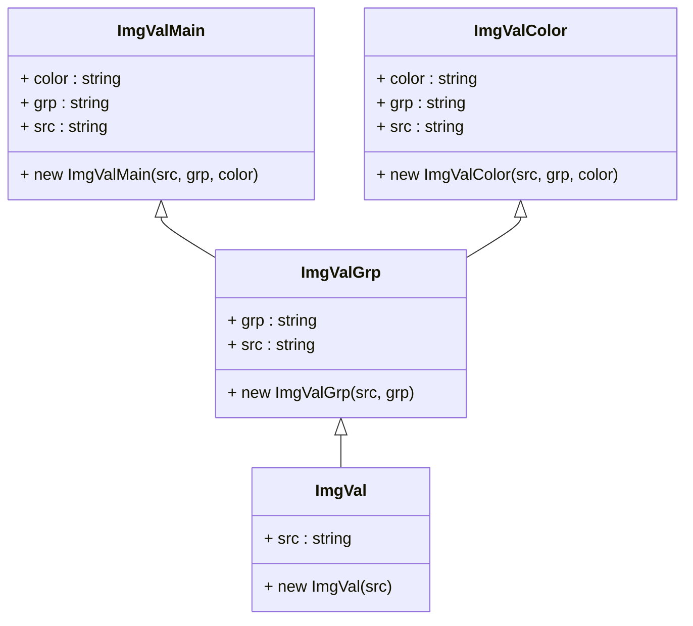

# Image



# Item

```mermaid
classDiagram
classDiagram
class Item {
+ Item(cssId)
+ getCssId()
+ getDisplayStatus()
+ getSrc()
+ setDisplay(flag)
+ setDisplayImage()
+ setImgVal(val)
}

class GrpItem extends Item {
+ setAction(makeupManager)
}

class MainItem extends Item {
+ getGrp()
+ getSeason()
}

class ColorItem extends Item {
func :function
+ setAction(makeupManager)
}


Item <|-- GrpItem
Item <|-- MainItem
Item <|-- ColorItem
```
