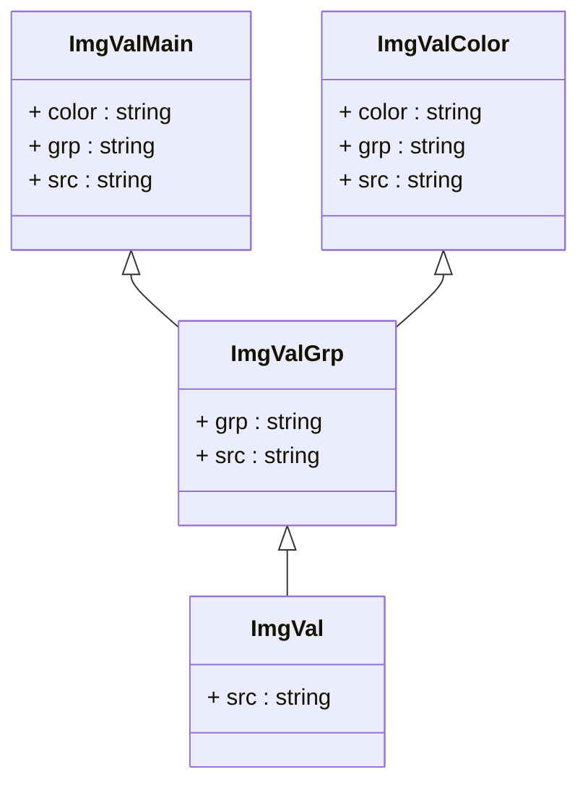

# Image

```mermaid
classDiagram
class ImgVal {
+ src : string
}

class ImgValMain {
+ color : string
+ grp : string
+ src : string
}

class ImgValColor {
+ color : string
+ grp : string
+ src : string
}

class ImgValGrp {
+ grp : string
+ src : string
}

ImgValMain <|-- ImgValGrp
ImgValColor <|-- ImgValGrp
ImgValGrp <|-- ImgVal
```

