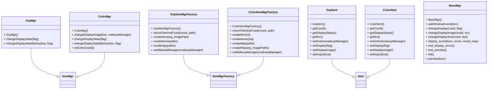

```mermaid
classDiagram
class GrpMgr {
  + GrpMgr()
  + changeDisplayState(flag)
  + changeDisplayStateByKey(key, flag)
}

class GrpItemMgrFactory {
  + GrpItemMgrFactory()
  + checkPathAndCssid(cssId, path)
  + createItem(arg_imagePath)
  + createItems(paths)
  + createMgr(paths)
  + setMakeupManager(makeupManager)
}

class GrpItem {
  + GrpItem()
  + getCssId()
  + getDisplayStatus()
  + getSrc()
  + setAction(makeupManager)
  + setDisplay(flag)
  + setDisplayImage()
  + setImgVal(val)
}

class ColorMgr {
  + ColorMgr()
  + changeDisplayImage(key, makeupManager)
  + changeDisplayState(flag)
  + changeDisplayStateByKey(key, flag)
  + initColorCssId()
}

class ColorItemMgrFactory {
  + ColorItemMgrFactory()
  + checkPathAndCssid(cssId, path)
  + createItem(ct)
  + createItems(rep)
  + createMgr(paths)
  + createRep(arg_imagePaths)
  + setMakeupManager(makeupManager)
}

class ColorItem {
  + ColorItem()
  + getCssId()
  + getDisplayStatus()
  + getSrc()
  + setAction(makeupManager)
  + setDisplay(flag)
  + setDisplayImage()
  + setImgVal(val)
}

class BaseMgr {
  + BaseMgr()
  + addWindowEvent(func)
  + changeDisplay(cssId, flag)
  + changeDisplayImage(cssId, src)
  + changeDisplayText(cssId, text)
  + display_score(func, score, result_map)
  + end_display_score()
  + end_preview()
  + init()
  + preview(func)
}

GrpMgr --|> ItemMgr
GrpItemMgrFactory --|> ItemMgrFactory
GrpItem --|> Item
ColorMgr --|> ItemMgr
ColorItemMgrFactory --|> ItemMgrFactory
ColorItem --|> Item
BaseMgr

```
